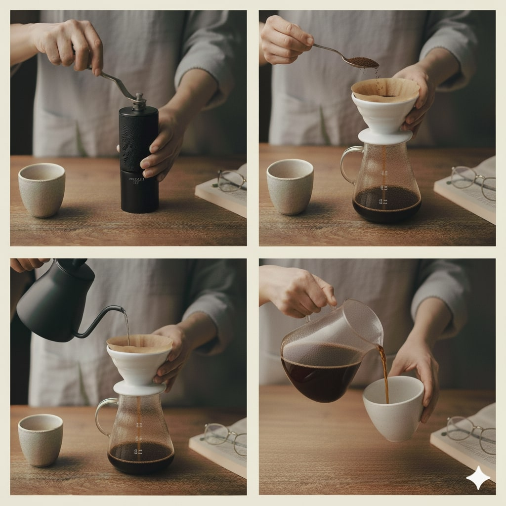

# **🚀 AI Prompts Showcase**  

Welcome to my **AI Prompting Portfolio**! Here i'll publish my expertise in crafting innovative, efficient, and optimized prompts for AI models, including the **Text-To-Image & Text-To-Video**.  

Featuring precisely-tested prompts, real-world AI projects, tutorials, and experiments with models like GPT-4o, Claude, grok, nano banana, seedream, and many more.

---

## 🌟 Featured Projects

### ☕ V60 Pour-Over Coffee Brewing Grid

**What it does**: A professional 2x2 photo grid documenting the complete V60 coffee brewing process - from grinding beans to the final pour.

**Why it's impressive**:
- ✅ Advanced composition control with frame-by-frame specifications
- ✅ Professional photography direction (LUT, shallow DOF, cinematic lighting)
- ✅ Sequential storytelling across 4 cohesive panels
- ✅ Social media-ready format (1:1 aspect ratio)
- ✅ Brand-quality output suitable for commercial use

**Use Cases**: Social media content, coffee shop marketing, tutorial materials, lifestyle photography

👉 **[View Full Prompt Documentation](Prompts/image-generation/v60-coffee-brewing-grid.md)**

---

### 🎁 Product Unboxing Photography: Gift Set Documentation

**What it does**: A premium 2x2 photo grid showcasing the complete luxury perfume gift set unboxing experience - from the initial reveal to the final product interaction.

**Why it's impressive**:
- ✅ **Advanced Complexity**: More technically challenging than V60 - requires extreme consistency in shadows, textures, and product placement
- ✅ **Commercial-Grade**: Blank products make it universally adaptable for any brand
- ✅ **Sequential Storytelling**: Frame 1 (Anticipation) → Frame 2 (Reveal) → Frame 3 (Interaction) → Frame 4 (Experience)
- ✅ **Technical Mastery**: Google Imagen 4 Ultra + Nanobanana + Upscayl upscaling
- ✅ **Real-World Challenges**: Overcame grid consistency problems through iterative regeneration

**Use Cases**: E-commerce product photography, luxury brand marketing, unboxing content, social media campaigns, product launches

👉 **[View Full Prompt Documentation](Prompts/image-generation/perfume-unboxing-grid.md)**

---

## **About Me**  

Hey! I am **Aman**, an aspiring **AI Prompt Engineer**, and I love working with language models to solve actual problems, not just theoretical ones.  

## **What I Do Best**
Prompt Crafting: Designing prompts that get more accurate, useful results from AI

## **What I Do**
Recently, I’ve been getting deep into generating media with AI. All my prompt work now is centered on a few exciting areas:

**Text-to-Video:** Writing prompts that turn a short story or idea directly into animated visual clips

**Text-to-Image:** Using simple descriptions to create original images or artwork

**Image-to-Image:** Tweaking existing images by guiding the AI to make changes, transformations, or enhancements

**Image-to-Video:** Transforming a single image into a video sequence or animation

**Reference-to-Video:** Taking a reference (like a photo or style sample) and using it as inspiration to produce customized video content

Basically, if it’s about converting text or images into something creative and visual—whether still or moving—I’m exploring and sharing prompts that make the magic happen.

---

## **Portfolio Highlights**  

### **1. Prompts**  
A curated library of prompts built for multimodal generation, blending creativity and technical nuance:  
- **Exploring text inputs that spark vivid visual scenes and animated sequences.
- **Crafting image-based prompts for nuanced transformations and style shifts.
- **Engineering references into dynamic video outputs, experimenting with context and detail.
- **Continuously refining prompt logic for smoother cross-modal translations and expressive results

Each prompt is accompanied by insights on design strategies and results.  

---

### **2. Projects**  
A snapshot of hands-on, real-world creative projects powered by AI prompt engineering:

#### **Faceless AI YouTube Channel**  
- Developed a complete YouTube channel where every video—scripts, narration, visuals, and edits—is generated by AI models.
- Utilized pipelines that blend text-to-video prompts, automated voice synthesis, and video editing frameworks.

#### **AI Podcast Studio**  
- Produced a podcast series with AI-generated hosts, topics, and discussions.  
- Designed workflows where text prompts became full episodes, from conceptual outlines to synthetic voices and music backgrounds.

#### **AI Product Shoot**  
- Designed an AI-powered product photoshoot system that generates studio-quality images from product descriptions, enhancing e-commerce listings without traditional photography.
- Leveraged text-to-image models and style transfer techniques to create visually cohesive product galleries, customizable for different themes, seasons, or branding needs.

#### **AI Album Cover Maker**  
- Craft striking, unique music album covers or visualized playlists using lyrics, themes, or mood references as prompt inputs for image generators.

---

### **3. Tutorials**  
Hands-on guides for unlocking **AI-powered image and video creation**:
- **How to connect and experiment with leading generative media APIs and platforms.
- **Creative prompt engineering tips for producing standout visuals and animations
- **Step-by-step workflows for adapting prompts to fit any style, brand, or project goal
  
Each tutorial is packed with clear examples, code, and practical tips for creators of all skill levels.

---

### **4. Research**  
Personal explorations and insights into the world of **AI-driven media**:
- **Testing and benchmarking prompt variations to boost visual quality and consistency 
- **Studying how human feedback and references can refine AI interpretations and outputs

All research is shared with the goal of making generative media tools smarter and more intuitive.

---

### **5. Assets**  
A growing library of helpful resources, including:
- **AI-Generated Images**: Explore a portfolio of visuals created from diverse prompts, covering portraits, landscapes, abstract art, and product showcases.
- **AI-Generated Videos**: Browse short clips and full video scenes produced by transforming text or image inputs into dynamic motion. 

---

## **How to Contribute**  

I welcome contributions and collaborations to expand this portfolio. You can:  
1. Fork the repository.  
2. Suggest improvements or add examples via pull requests.  

Let’s work together to innovate in **AI Prompt Engineering**!  

---

## **Contact Me**  

Feel free to reach out for collaborations, inquiries, or project discussions:  
- **Email**: [n3owise@gmail.com](mailto:n3owise@gmail.com)  
- **LinkedIn**: [linkedin.com/in/amanverma-zip](https://www.linkedin.com/in/amanverma-zip/)  

---

🌟 **Thank You!**  

Thank you for exploring my portfolio. I hope it inspires new ideas and encourages innovation in the field of **AI Prompt Engineering**.  

